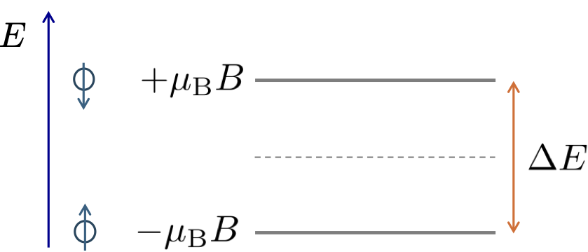

# Relativistic Quantum Mechanics

<!-- 

Content:

Derive the Noether current.
Move to interacting Dirac equation and show it is minimally coupled. 

Motivate coupling to EM via the classical non-relativistic Lagrangian, leading to the covariant derivative for minimal coupling. Discuss gauge transformations and how a local phase transformation is required to make the covariant derivative "covariant".

Mention KG is not really minimally coupled (like Schrödinger)

Arrive at the "classical" QED Lagrangian.

-->

This final **non-examinable** lecture is a very brief introduction to *Relativistic Quantum Mechanics*. The aim is to give a flavour of the subject and to show how the tools we have developed in this course can be used to understand some of the key features of relativistic quantum theories, such as the Klein-Gordon and Dirac equations, and how they couple to electromagnetism. The purpose is to provide a useful stepping stone from this course to the 4th year Quantum Field Theory course. [While the content in this lecture makes for great exam questions, it has to be non-examinable, since after all this is a course on Advanced Classical Mechanics, not Quantum Mechanics!]{.aside} 

## Quantum mechanics as a classical field theory
So far we have considered fields as real and complex scalar fields, as well as 4-vector/one-form and tensor fields. Our use of complex scalar fields has been purely for algebraic convenience since they can be decomposed into independent real and imaginary parts each described by two real scalar fields. We did not assigned any physical significance to a complex field beyond this. Consequently, the mathematical tools we have developed for classical field theories, Lagrangians, relativistic Euler-Lagrange equations, Noether currents etc., can formally be applied to quantum mechanics by simply interpreting the wavefunction $\psi$ itself as a classical complex scalar field. Of course this there will be some subtleties in doing this, since in quantum mechanics the complex character of the field is fundamental to its interpretation.

The basic observational facts of quantum mechanics are encapsulated in the Einstein-Plank relation
$$
    \mathcal{E} = \hbar \omega,
$$
and the de Broglie relation
$$
    \boldsymbol{p} = \hbar \boldsymbol{k},
$$
which relate the relativistic energy $\mathcal{E}$ and relativistic 3-momentum $\boldsymbol{p}$ of a particle to the angular frequency $\omega$ and wavevector $\boldsymbol{k}$ of its associated wave. What is not often made clear in early quantum mechanics courses is that these relations are actually relativistic, and that they can be expressed in a 4-vector form as 
$$
    p^\mu = \hbar k^\mu, \quad {\rm or} \quad \begin{pmatrix} \mathcal{E}/c \\ \boldsymbol{p} \end{pmatrix} = \hbar \begin{pmatrix} \omega/c \\ \boldsymbol{k} \end{pmatrix}.
$$
This relation applies to **all** quantum theories, relativistic or otherwise. 

A quantum wave with well-defined $\boldsymbol{k}$ and $\omega$ is called a plane-wave, and has the form
$$
    \psi(t, \boldsymbol{r}) = A e^{-i\omega t + i \boldsymbol{k} \cdot \boldsymbol{r}} = A e^{-i k_\mu x^\mu}.
$${#eq-plane-wave}
From this "solution" we can motivate the form of the energy and momentum operators in quantum mechanics, which are given by
$$
    \hat{\mathcal{E}} = i \hbar \frac{\partial}{\partial t}, \quad {\rm and} \quad \hat{\boldsymbol{p}} = -i \hbar \nabla.
$${#eq-energy_momentum_operators}
The reason for this is seen once we apply these operators to the plane-wave solution we get
$$
    \hat{\mathcal{E}} \psi(t, \boldsymbol{r})= i \hbar \frac{\partial}{\partial t} \left( A e^{-i\omega t + i \boldsymbol{k} \cdot \boldsymbol{r}} \right) = \hbar \omega \psi(t, \boldsymbol{r}) = \mathcal{E} \psi(t, \boldsymbol{r}),
$$
and
$$    
    \hat{\boldsymbol{p}} \psi(t, \boldsymbol{r}) = -i \hbar \nabla \left( A e^{-i\omega t + i \boldsymbol{k} \cdot \boldsymbol{r}} \right) = \hbar \boldsymbol{k} \psi(t, \boldsymbol{r}) = \boldsymbol{p} \psi(t, \boldsymbol{r}).
$$
As expected the plane-wave in @eq-plane-wave is an eigenstate of the energy and momentum operators, with eigenvalues given by the Einstein-Plank and de Broglie relations. Again the operators $\hat{\mathcal{E}}$ and $\hat{\boldsymbol{p}}$ are a very general results and apply to all quantum theories, relativistic or otherwise.

To build a quantum wave theory we want it to be:

1. built from $\hat{\mathcal{E}}$ and $\hat{\boldsymbol{p}}$ in @eq-energy_momentum_operators via a dispersion relation relating these two quantities and

2. to be linear in the wavefunction $\psi(t, \boldsymbol{r})$ so that it supports the superposition of solutions expected of a wave theory.

The simplest example of this is Schrödinger's equation
$$
    i \hbar \frac{\partial}{\partial t} \psi(t, \boldsymbol{r}) = \left( -\frac{\hbar^2}{2m} \nabla^2 + V(\boldsymbol{r}) \right) \psi(t, \boldsymbol{r}).
$${#eq-schrodinger}
well known to you from earlier quantum mechanics courses.

::: {.callout-note appearance="simple" icon=false}
## Constructing Schrödinger's equation

Schrödinger constructed his famous equation by appealing to classical non-relativistic mechanics. The non-relativistic energy is given by the Hamiltonian
$$
    \mathcal{E} = H(\boldsymbol{r},\boldsymbol{p}).
$${#eq-nr-dispersion}
Next, we introduce the position operator defined by the action on any wavefunction as
$$
    \hat{\boldsymbol{r}}\psi(t, \boldsymbol{r}) = \boldsymbol{r}\psi(t, \boldsymbol{r}).
$$
Then we "first" quantize the classical system by making the replacement $\boldsymbol{r} \to \hat{\boldsymbol{r}}$ $\boldsymbol{p} \to \hat{\boldsymbol{p}}$ and $\mathcal{E} \to \hat{\mathcal{E}}$ in @eq-nr-dispersion. For a single-particle in a potential $V(\boldsymbol{r})$ the non-relativistic Hamiltonian will be
$$
    H(\boldsymbol{r},\boldsymbol{p}) = \frac{\boldsymbol{p}^2}{2m} + V(\boldsymbol{r}),
$$
which quantizes as
$$
    H(\boldsymbol{r},\boldsymbol{p}) \to H(\hat{\boldsymbol{r}},\hat{\boldsymbol{p}}) = -\frac{\hbar^2}{2m} \nabla^2 + V(\hat{\boldsymbol{r}}).
$$
The resulting time-dependent Schrödinger equation is then
$$
    i \hbar \frac{\partial}{\partial t} \psi(t, \boldsymbol{r}) = \left( -\frac{\hbar^2}{2m} \nabla^2 + V(\boldsymbol{r}) \right) \psi(t, \boldsymbol{r}).
$$
:::

There are a few crucial points to notice about Schrödinger's equation. 

- It is first-order in time, but second-order in space. This means that the time evolution of the wavefunction is determined by its value at a single time, but its spatial profile is determined by its value and first spatial derivative at a single time. This is a consequence of the non-relativistic dispersion relation $\mathcal{E} = \boldsymbol{p}^2/2m + V(\boldsymbol{r})$ being first-order in energy but second-order in momentum.

- It is not Lorentz covariant, since it treats time and space differently. This is again a consequence of it being constructed using the non-relativistic dispersion relation.

- It looks like the diffusion equation, but with an imaginary unit $i$. This is again a consequence of the non-relativistic dispersion relation being parabolic in momentum. 

- It is intrinsically complex, this is essential for the Schrödinger equation to support wave-like solutions and the superposition principle.

::: {.callout-note appearance="simple" icon=false}
## Schrödinger equation is intrinsically complex

We can expand upon this point more. Suppose that we have a free particle with $V(\boldsymbol{r}) = 0$, then plane-wave solutions have
$$
    \mathcal{E} = \frac{\boldsymbol{p}^2}{2m} = \frac{\hbar^2 \boldsymbol{k}^2}{2m} \geq 0,
$$
so the energy is always positive. This is sensible since it tells us that the energy of particle is bounded from below meaning there exists a well-defined ground state for a free-particle. It also means the angular frequency $\omega = \mathcal{E}/\hbar \geq 0$. 

Now consider the Fourier transform of a real function $f(t,\boldsymbol{r}) \to F(\omega, \boldsymbol{k})$. Since $f(t,\boldsymbol{r})$ is real, its Fourier transform must satisfy the conjugate symmetry condition
$$
    F(-\omega, -\boldsymbol{k}) = F^*(\omega, \boldsymbol{k}).
$$
This means that if $F(\omega, \boldsymbol{k})$ is non-zero for some $\omega$ and $\boldsymbol{k}$, then it must also be non-zero for $-\omega$ and $-\boldsymbol{k}$. This is a problem for the Schrödinger equation since the dispersion relation only allows for $\omega \geq 0$, so if we have a solution with $\omega > 0$ then we must also have a solution with $\omega < 0$ which is not allowed by the dispersion relation. This means that the Schrödinger equation cannot support real solutions. They must be intrinsically complex to be consistent with its dispersion relation.

Another way to see this is that all solutions to the time-dependent Schrödinger equation are complex. Take an eigenstate of the Hamiltonian
$$
    H(\hat{\boldsymbol{r}},\hat{\boldsymbol{p}})\phi( \boldsymbol{r}) = \mathcal{E}\phi( \boldsymbol{r}),
$$
with energy $\mathcal{E}$, then its time-evolving solutions are given by
$$
    \psi(t, \boldsymbol{r}) = e^{-i\mathcal{E}t/\hbar} \phi( \boldsymbol{r}),
$$ 
meaning they pick up a complex phase factor as they evolve in time. All other solutions are constructed as superpositions of these energy eigenstates, so they will also be complex.
:::

To move to a relativistic quantum theory we need to change the dispersion relation from $\mathcal{E} = \frac{\boldsymbol{p}^2}{2m}$ to a relativistic one 
$$
    \mathcal{E}^2 = \boldsymbol{p}^2 c^2 + m^2 c^4.
$$ 
If we want to keep our theory first-order in time, as the Schrödinger equation is, then we need to take the square-root of this dispersion relation
$$
    \mathcal{E} = \sqrt{\boldsymbol{p}^2 c^2 + m^2 c^4}.
$$
The question is do we take the $+$ or $-$ square-root? The negative root appears troublesome since it would allow for unbounded negative energies suggesting the theory does not have a stable well-defined ground state. Suppose we just take the $+$ root, then we arrive at the equation
$$
    i \hbar \frac{\partial}{\partial t} \varphi(t, \boldsymbol{r}) = \sqrt{-\hbar^2 c^2 \nabla^2 + m^2 c^4} ~\varphi(t, \boldsymbol{r}),
$$
for a complex scalar field $\varphi(t, \boldsymbol{r})$. This equation has many problems, it is non-local in space since the square-root of the Laplacian is a non-local operator, and it is not Lorentz covariant since it still treats time and space differently.

An immediate alternative is to avoid the square-root entirely and instead directly quantize the relativistic dispersion relation as
$$
    (i\hbar\partial_t)^2 \varphi(t, \boldsymbol{r}) = (-\hbar^2 c^2 \nabla^2 + m^2 c^4) \varphi(t, \boldsymbol{r}).
$$
This rearranges to
$$
    \left(\frac{1}{c^2}\partial^2_t - \nabla^2 + \frac{m^2 c^2}{\hbar^2}\right)\varphi(t, \boldsymbol{r}) = 0,
$$
or in a more compact 4-vector form
$$
    \left(\partial_\mu \partial^\mu + \frac{m^2 c^2}{\hbar^2}\right)\varphi(t, \boldsymbol{r}) = 0,
$${#eq-kg_eq}
and we arrive at the Klein-Gordon (KG) equation where the Lorentz constant $\hbar/mc$ is the reduced Compton wavelength. The KG equation is second-order in time and space, and is relativistically covariant since it is essentially the wave equation with a mass term which we have considered earlier in [Plane-waves and particle flows](planewaves.qmd). There we solved the @eq-kg_eq for a plane-wave and found
$$
     k_\mu k^\mu = \frac{m^2 c^2}{\hbar^2},
$$
giving a dispersion relation
$$
  (\hbar\omega)^2 = |\hbar\boldsymbol{k}|^2c^2 + m^2c^4,
$${#eq-kg_wave_dispersion}
consistent with the relativistic energy-momentum relation $\mathcal{E}^2 = p^2c^2 + m^2c^4$ for a particle with mass $m$. An immediately consequence of this is that
$$
    \hbar\omega = \pm \sqrt{|\hbar\boldsymbol{k}|^2c^2 + m^2c^4},
$$
and so the KG equations supports both positive and negative energy solutions. This is a major problem for interpretating the KG equation as a single-particle quantum theory since there won't be a stable ground state. One could think that the negative energy solutions can just be rejected as a mathematical artefact. The issue is that even if we start with an initial state comprising a superposition of only positive energy solutions, the time evolution of the wavefunction according to @eq-kg_eq will inevitably introduce negative energy solutions into the superposition. They are intrinisic to the KG equation and cannot be ignored. 

Another issue is that @eq-kg_eq is second-order in time meaning that the evolution of the wavefunction from $t=0$ is determined not just by $\varphi(0,\boldsymbol{r})$ but also its first time-derivative $\partial_t\varphi(t,\boldsymbol{r})|_{t=0}$. This is a radical conceptual departure from the Schrödinger equation where the wavefunction $\psi(t,\boldsymbol{r})$ at any point in time $t$ is considered as containing all the information about the system and its evolution. There are futher issues with the KG equation which are best revealed by applying the tools of classical field theory to it.

::: {.callout-tip collapse="true"}
## Non-relativistic limit of the KG equation

The non-relativistic limit of the total energy for a particle is 
$$
    E = \frac{p^2}{2m} + mc^2 + \dots
$$
and contains the rest mass energy as well as the kinetic energy. Let us write our relativistic wave function $\varphi(t,\boldsymbol{r})$ that is a solution to the Klein-Gordon equation in terms of another function $\psi(t,\boldsymbol{r})$ defined as 
$$
    \varphi(t,\boldsymbol{r})= \psi(t,\boldsymbol{r})e^{-i mc^2 t/\hbar}. 
$${#eq-rest_energy_psi}
What we have done here is to add a time-dependent phase factor proportional to the rest energy. The purpose of this is revealed by substituting @eq-rest_energy_psi into @eq-kg_eq from which we get the following
$$
    \left(-\frac{1}{c^2}\frac{\partial^2}{\partial t^2}  + \frac{2m i}{\hbar}\frac{\partial}{\partial t}  + \frac{m^2 c^2}{\hbar^2} +  \nabla^2 - \frac{m^2c^2}{\hbar^2}\right)\psi(t,\boldsymbol{r}) = 0.
$$
We notice that two new terms have appeared, one which cancels the rest mass term and the other introduces a first derivative in time. Next we take the non-relativistic limit where $c \rightarrow \infty$ which causes the second time derivative to vanish and leaves
$$
    i\hbar\frac{\partial}{\partial t}\psi(t,\boldsymbol{r}) =  -\frac{\hbar^2}{2m}\nabla^2 \psi(t,\boldsymbol{r}),
$$
which we immediately recognise as the free-particle Schrödinger equation. Indeed, this tell us that the Klein-Gordon equation is the direct relativistic generalisation of the Schrödinger equation.
:::

## Lagrangian formulation and Noether currents
Like any classical field we can write down a Lagrangian for the Schrödinger and KG equations, and apply the relativistic Euler-Lagrange equations to derive these equations of motion. We can also identify symmetries of these Lagrangians and compute the associated Noether currents. To set the scene it is worth applying these tools first to the Schrödinger equation, even though this is not a relativistic theory.

### Schrödinger Lagrangian
Although it is not relativistic we can nonetheless construct a Lagrangian such that the Schrödinger equation is arises from the relativistic Euler-Lagrange equations. Specifically, it is given by
$$
    \mathcal{L}_{\rm SE} = \frac{i\hbar}{2} \left( \psi^* \partial_t \psi - \psi \partial_t \psi^*\right) - \frac{\hbar^2}{2m} \nabla \psi^* \cdot \nabla \psi - V(\boldsymbol{r}) \psi^* \psi.
$$
Here $\psi$ and $\psi^*$ are treated as independent fields, and we apply the relativistic Euler-Lagrange equations to $\mathcal{L}_{\rm SE}$ to the conjugate $\psi^*$ as
$$
    \frac{\partial \mathcal{L}_{\rm SE}}{\partial \psi^*} - \partial_\mu \frac{\partial \mathcal{L}_{\rm SE}}{\partial (\partial_\mu \psi^*)} = 0,
$$
which yields the Schrödinger equation @eq-schrodinger for $\psi(t,\boldsymbol{r})$. Despite the Lagrangian $\mathcal{L}_{\rm SE}$ being intrinsically complex, and not being Lorentz scalar, we can still apply the tools of classical field theory to it. For example, since $\psi$ and $\psi^*$ appearing together in pairs in $\mathcal{L}_{\rm SE}$ it possesses a global $U(1)$ symmetry under the transformation
$$
    \psi(t,\boldsymbol{r}) \to e^{i\alpha}\psi(t,\boldsymbol{r}), \quad {\rm and} \quad \psi^*(t,\boldsymbol{r}) \to e^{-i\alpha}\psi^*(t,\boldsymbol{r}),
$$
for constant phase $\alpha$. In the limit of small $\alpha$ we have
$$
    \psi(t,\boldsymbol{r}) \approx \psi(t,\boldsymbol{r}) + i\alpha\psi(t,\boldsymbol{r}), \quad {\rm and} \quad \psi^*(t,\boldsymbol{r}) \approx \psi^*(t,\boldsymbol{r}) - i\alpha\psi^*(t,\boldsymbol{r}),
$$
and as a result Noether's theorem gives a 4-current
$$
    j^\mu_{\rm SE} = \frac{\partial \mathcal{L}_{\rm SE}}{\partial (\partial_\mu \psi)} (i\alpha \psi) + \frac{\partial \mathcal{L}_{\rm SE}}{\partial (\partial_\mu \psi^*)} (-i\alpha \psi^*),
$$
which evaluates as
$$
    j^\mu_{\rm SE} = \begin{pmatrix} \rho_{\rm SE}(t,\boldsymbol{r})c \\
     \boldsymbol{j}_{\rm SE}(t,\boldsymbol{r}) \end{pmatrix} =  -\hbar\alpha\begin{pmatrix} |\psi|^2c \\
     \frac{\hbar}{2mi} \left( \psi^* \nabla \psi - \psi \nabla \psi^* \right) \end{pmatrix}.
$$
As usual the Noether current has an arbitrary overall normalisation under rescaling of the symmetry parameter $\alpha$. Consequently, we can divide through by $-\hbar\alpha$ to get a more standard form where $\rho_{\rm SE}(t,\boldsymbol{r})$ is the non-negative probability density of the particle and $\boldsymbol{j}_{\rm SE}(t,\boldsymbol{r})$ is the associated probability current density. These quantities should be recognisable from your earlier studies of the Schrödinger equation. Despite appearances $j^\mu_{\rm SE}$ is **not** a bonifide 4-vector since it was derived from a non-covariant Lagrangian. However, it does by construction obey the continuity equation $\partial_\mu j^\mu_{\rm SE} = 0$ equivalent to
$$
    \partial_t \rho_{\rm SE}(t,\boldsymbol{r}) + \nabla \cdot \boldsymbol{j}_{\rm SE}(t,\boldsymbol{r}) = 0,
$$ 
for an associated conserved charge 
$$    
    P(t) = \int_\mathcal{V} {\rm d}^3\boldsymbol{r} ~\rho_{\rm SE}(t,\boldsymbol{r}),    
$$
which is the total probability of finding the particle in the 3-volume \mathcal{V}. Thus, we have established that the global $U(1)$ symmetry of the Schrödinger Lagrangian is associated with the conservation of total probability. Together with its lower bound on the energy of a free particle this probability interpretation of the Noether current is a key feature of non-relativistic quantum mechanics which we will aim to reproduce in the relativistic regime. 

### Klein-Gordon Lagrangian
Having arrived at the KG equation in @eq-kg_eq we can similarly write down an Lagrangian for it, identify its symmetries and compute the associated Noether currents. The KG equation supports both real and complex solutions $\varphi(t, \boldsymbol{r})$ so can be derived from the Lagrangian densities
$$
\begin{align}
    \mathcal{L}^{(\mathbb{R})}_{\rm KG} &= \hbar c\left(\partial_\mu\varphi\partial^\mu\varphi - \left(\frac{mc}{\hbar}\right)^2\varphi^2\right) \quad\quad \rm{real}~\varphi, \\
    \mathcal{L}^{(\mathbb{C})}_{\rm KG} &= \hbar c\left(\partial_\mu\varphi\partial^\mu\varphi^* - \left(\frac{mc}{\hbar}\right)^2\varphi^*\varphi\right) \quad \rm{complex}~\varphi.
\end{align}
$$
As usual we demand that the Lagrangian density $\mathcal{L}$ is a real Lorentz scalar for either field, and the factor of $\hbar c$ ensures the correct units. The complex version is most relevant for relativistic quantum mechanics. In this case applying the relativistic Euler-Lagrange equations to $\mathcal{L}^{(\mathbb{C})}_{\rm KG}$ to the conjugate $\varphi^*$ field yields the KG equation for $\varphi(x)$.

Like the Schrödinger Lagrangian, $\mathcal{L}^{(\mathbb{C})}_{\rm KG}$ possesses a global $U(1)$ symmetry under the transformation 
$$
    \varphi(x) \to e^{i\alpha}\varphi(x), \quad {\rm and} \quad \varphi^*(x) \to e^{-i\alpha}\varphi^*(x),
$$
for constant phase $\alpha$. Applying Noether's theorem  (again dropping the overall factor of $-\hbar\alpha$) yields the conserved current
$$
    j^\mu_{\rm KG} = i c \left( \varphi^* \partial^\mu \varphi - \varphi \partial^\mu \varphi^* \right),   
$$
with an associated conserved charge is given by
$$
    Q = \int_\mathcal{V} {\rm d}^3\boldsymbol{r} ~j^0_{\rm KG}(t,\boldsymbol{r}),                   
$$
and satisfying the continuity equation
$$
    \partial_\mu j^\mu_{\rm KG} = 0.
$$
Since $j_{\rm KG}^\mu$ is derived from a real Lorentz scalar Lagrangian it is a bonifide 4-vector, and the associated conserved charge $Q$ is Lorentz invariant.

Writing out the components of $j^\mu_{\rm KG}$ we have
$$
    j^\mu_{\rm KG} = \begin{pmatrix} \rho_{\rm KG}(t,\boldsymbol{r})c \\
     \boldsymbol{j}_{\rm KG}(t,\boldsymbol{r}) \end{pmatrix} = \begin{pmatrix} i(\varphi^* \partial_t \varphi - \varphi \partial_t \varphi^*)\\
      ic\left( \varphi^* \nabla \varphi - \varphi \nabla \varphi^* \right) \end{pmatrix}.
$$
The spatial components of this current $\boldsymbol{j}_{\rm KG}$ is, upto a factor of $-\hbar/2m$, formally the same as the probability current $\boldsymbol{j}_{\rm SE}$ for the Schrödinger equation. However, the time-component $j^0$ is very different. We can see this by writing
$$
    j^0 = 2\,{\rm Im} \left\{ \varphi^* \partial_t \varphi \right\},
$$
so if we take a plane-wave solution of the form
$$    
    \varphi(t, \boldsymbol{r}) = A e^{-i\omega t + i \boldsymbol{k} \cdot \boldsymbol{r}},
$$
then the conserved charge density is given by
$$    
    \rho_{\rm KG}(x) = 2\frac{\omega}{c}|A|^2.
$$
For positive energy solutions, with $\omega > 0$, we have $j^0 > 0$, but for the negative energy solution, with $\omega < 0$, we have $j^0 < 0$. Consequently, negative energy solutions directly prohibit the interpretation of $\rho_{\rm KG}(x)$ arising from the global $U(1)$ symmetry as a probability density. [Actually $j^0_{\rm KG}$ behaves like an electrical charge density which can be positive or negative. The reason for this is that the positive energy solutions correspond to particles with charge $q$ and mass $m$, while the negative energy solutions correspond to antiparticles with charge $-q$ and mass $m$. However, to make this identification rigorous requires sophisticated tools from next year's quantum field theory course.]{.aside} This issue prevents the KG theory from being a physically consistent single-particle quantum theory.

## Describing the hydrogen atom
In fact Schrödinger wrote down the KG equation at the same time he wrote down his famous equation. At the time he was working on describing the electron in the hydrogen atom and trying to reproduce the increasingly accurate measurements of its energy level structure. Crude semi-classical models of the atom already indicated that the electron's orbital motion should be described by a relativistic quantum theory, so naturally Schrödinger initially tried to use the KG equation, but he also computed it using his non-relativistic equation. He expected the KG equation to be more accurate. 

In @fig-hydrogen_spectrum the two spectra are shown side-by-side, along with that "observed" experimentally. [Strictly speaking, the "observed" spectrum is actually the one computed using the Dirac equation which we will discuss shortly. It is not exact, but it is extremely accurate.]{.aside} What is clear from this figure is that the Schrödinger equation predicts sets of degenerate energy levels called the "gross" structure, whereas in the real spectrum these levels are both shifted and split by relativistic effects giving "fine" structure. The KG equation does predict that such splittings occur but their value shows significant discrepancies with the observed fine structure.

For example, the ground state is shifted downwards in the KG equation by far more than observed. Beyond this, the remaining degeneracies of the levels is also wrong. For first excited states with $n=2$ the Schrödinger equation predicts a eight-fold degenerate energy level comprising one S orbital and three P orbitals, multiplied by two due to spin (see next). The KG equation predicts these levels are split by a large amount according to S and P, so giving two and six-fold degeneracies, respecitively. In reality the $n=2$ levels experience a much smaller split into two four-fold degenerate levels. So, despite being formally less accurate the Schrödinger equation result actually serves as a better starting point for understanding the energy level structure of hydrogen on top of which relativistic corrections can be added back perturbatively.

{width="800"  #fig-hydrogen_spectrum}

What this tells us is that the KG equation, while being a relativistic quantum theory, is not the correct relativistic quantum theory for describing the electron. It introduces the kinetic energy relativistic correction to the energy levels of hydrogen, but misses out other equally important and often opposing corrections (like spin-orbit coupling), and so rather than refining the gross energy level structure predicted by the Schrödinger equation it actually makes it irrecoverably worse. 

## Describing spin
Solving the hydrogen atom reveals that there is a deeper problem with the KG equation, which is that it does not account for the intrinsic spin of the electron. The Stern-Gerlach experiment shows that the electron is a spin-1/2 particle carrying an intrinsic "spin" angular momentum of $\hbar/2$ which is independent of its orbital motion. This spin couples to the orbital motion of the electron and produces additional relativistic fine corrections of the energy levels of hydrogen. Neither the Schrödinger equation nor the KG equation can account for these since they are both spin-0 theories. 

{width="300"  #fig-zeeman_split}

Here again the Schrödinger equation, being non-relativistic, is a better platform for bolting on "by hand" spin. Specifically, we elevate the Schrödinger wavefunction to a two-component spinor wavefunction and add a Pauli term to the Hamiltonian which accounts for the coupling of the electron's spin to an external magnetic field $\boldsymbol{B}$ as
$$
    i\hbar \frac{\partial}{\partial t} \boldsymbol{\psi}(t, \boldsymbol{r}) = \left( -\frac{\hbar^2}{2m} \nabla^2 + V(\boldsymbol{r}) + \frac{e\hbar}{2mc} \boldsymbol{\sigma} \cdot \boldsymbol{B} \right) \boldsymbol{\psi}(t, \boldsymbol{r}),
$$
where the wave function $\boldsymbol{\psi}(t, \boldsymbol{r})$ is now a two-component spinor,
$$
    \boldsymbol{\psi}(t, \boldsymbol{r}) = \begin{pmatrix} \psi_\uparrow(t, \boldsymbol{r}) \\ \psi_\downarrow(t, \boldsymbol{r}) \end{pmatrix},
$$
describing the two spin states of the electron, and $\boldsymbol{\sigma}$ is 3-vector of $2 \times 2$ Pauli matrices
$$
    \boldsymbol{\sigma} = \begin{pmatrix} \sigma_x \\ \sigma_y \\ \sigma_z \end{pmatrix}.
$$
The Hilbert space of this theory is now the tensor product of the spatial Hilbert space $L_2(\mathbb{R}^3)$ of square-integrable functions on $\mathbb{R}^3$ and the two-dimensional spin Hilbert space $\mathbb{C}^2$. The dot-product form of the Pauli term is motivated by the classical interaction energy of a magnetic moment $\boldsymbol{\mu}$ with a magnetic field $\boldsymbol{B}$ given by $-\boldsymbol{\mu} \cdot \boldsymbol{B}$. From this we identify the electron's intrinsic magnetic moment as being given by $\boldsymbol{\mu} = -\frac{e\hbar}{2mc}\boldsymbol{\sigma}$. The Pauli term accounts for the Zeeman splitting of the energy levels of hydrogen in an external magnetic field, and can describe the spin discriminating dynamics of the Stern-Gerlach experiment.  

## The Dirac equation
There are a lot of unanswered questions at this point. 
Neither the KG equation or the Schrödinger equation naturally describe spin, while in the latter case we had to shoehorn it in ad-hoc style. It is therefore natural to ask if there is a consistent relativistic quantum theory which can account for the intrinsic spin of the electron and the relativistic corrections to the hydrogen atom. In 1928 Dirac was searching for a precisely this theory. 

### Factorising the square-root
Dirac was guided by the following properties:

1. The equation should be invariant under Lorentz transformations, which implies that the derivatives in space and time must be of the same order (as they are in the wave equation and Klein-Gordon equation where they are both second order).

2. The theory should be linear in the wavefunction $\boldsymbol{\Psi}(t, \boldsymbol{r})$ so that it supports the superposition of solutions expected of a wave theory.

3. Free-particle energy eigenstates of the theory should possess energies that obey the relativistic relation $E^2 = p^2c^2 + m^2c^4$.

4. Energy $\hat{\mathcal{E}}$ and momentum operators $\hat{\boldsymbol{p}}$ in the theory will follow from the standard canonical quantization rules in @eq-energy_momentum_operators.

5. The equation will have a form similar to the Schrödinger equation as
$$
    i \hbar \frac{\partial \boldsymbol{\Psi}(t,\boldsymbol{r})}{\partial t} = \hat{H}\boldsymbol{\Psi}(t,\boldsymbol{r}).
$$
Being first order in time the form implies that knowledge of the putative object $\boldsymbol{\Psi}(t,\boldsymbol{r})$ at time $t$ should allow its subsequent form at any other time to be computed. 

6. Time evolution will be governed by a relativistic Hamiltonian $\hat{H}$ that is hermitian. 

Satisfying properties 5 and 6 above therefore requires that $\hat{H}$ contains only first order derivatives in space, so $\hat{\boldsymbol{p}}$ must appear linearly in $\hat{H}$. This is a major departure from the non-relativistic Schrödinger equation where the energy is quadratic in momentum.

Dirac's sizable wish-list is a much more extended version of our approach to finding the Schrödinger and Klein-Gordon equations. To accomplish it Dirac first made an important observation about the expression $E = (p^2c^2 + m^2c^4)^{1/2}$ by considering a factorisation of the square-root of the form
$$
    E = \sqrt{p^2c^2 + m^2c^4} = \hat{\boldsymbol{\alpha}}\cdot \hat{\boldsymbol{p}} c + \hat{\beta} mc^2.
$${#eq-energy_fac}
Owing to the dot product with momentum in this expression we have an object
$$
    \hat{\boldsymbol{\alpha}} = \left(\begin{array}{c}
    \hat{\alpha}_x  \\
    \hat{\alpha}_y   \\
    \hat{\alpha}_z  
    \end{array}\right),
$$
which has vector character, and another $\hat{\beta}$ with a scalar character. As will become clear very soon this factorisation is impossible if we take $\hat{\boldsymbol{\alpha}}$ to be an ordinary vector with scalar components and $\hat{\beta}$ as a scalar. For this reason we denote them with $\hat{\cdot}$ to indicate that they are in fact matrices. 

To determine $\hat{\boldsymbol{\alpha}}$ and $\hat{\beta}$ we square the righthand side carefully by not assuming commutativity in the multiplication between the components of $\hat{\boldsymbol{\alpha}}$ and $\hat{\beta}$. This results in a long expression
$$
\begin{align}
    E^2 &= (\hat{\boldsymbol{\alpha}}\cdot {\bf p} c + \hat{\beta} mc^2)(\hat{\boldsymbol{\alpha}}\cdot {\bf p} c + \hat{\beta} mc^2), \\
    &= \hat{\alpha}_x^2p_x^2c^2 + \hat{\alpha}_y^2p_y^2c^2 + \hat{\alpha}_z^2p_z^2c^2 + \hat{\beta}^2 m^2c^4 + (\hat{\boldsymbol{\alpha}}\cdot {\bf p} \hat{\beta} + \hat{\beta} \hat{\boldsymbol{\alpha}}\cdot {\bf p}) mc^3  \\
    & \quad + \, \Big((\hat{\alpha}_x\hat{\alpha}_y + \hat{\alpha}_y\hat{\alpha}_x)p_xp_y + (\hat{\alpha}_y\hat{\alpha}_z + \hat{\alpha}_z\hat{\alpha}_y)p_yp_z + (\hat{\alpha}_x\hat{\alpha}_z + \hat{\alpha}_z\hat{\alpha}_x)p_xp_z\Big)c^2.
\end{align}
$$
For this equation to reduce down to $p^2c^2 + m^2c^4$ the last five terms must vanish. First, we require that 
$$
    \hat{\boldsymbol{\alpha}}\hat{\beta} + \hat{\beta}\hat{\boldsymbol{\alpha}} = \{\hat{\boldsymbol{\alpha}},\hat{\beta}\} = 0,
$$ 
where the curly braces denote the anticommutator. So $\hat{\beta}$ needs to anticommute with each component of $\hat{\boldsymbol{\alpha}}$. Second, we require that
$$
    \{\hat{\alpha}_x,\hat{\alpha}_y\} = \{\hat{\alpha}_y,\hat{\alpha}_z\} = \{\hat{\alpha}_x,\hat{\alpha}_z\} = 0,
$$
so each component of $\hat{\boldsymbol{\alpha}}$ anticommutes with the others. We therefore see that had $\hat{\boldsymbol{\alpha}}$ and $\hat{\beta}$ been composed of scalars we would instead have commutivity and no such cancellations would be possible. Finally we require that 
$$
    \hat{\alpha}_x^2 = \hat{\alpha}_y^2 = \hat{\alpha}_z^2 = \hat{\beta}^2 = \mathbb{1},
$$ 
namely these matrices must square to the identity. Provided these conditions are met then @eq-energy_fac is a valid factorisation of the relativistic energy relation once we read $E$ as being $E \times \mathbb{1}$. 

Given this factorisation and following property 4 above Dirac then applied the canonical transformations to arrive at the equation
$$
\begin{align}
    i\hbar\frac{\partial}{\partial t}\boldsymbol{\Psi}(t,\boldsymbol{r}) &= \left(c \hat{\boldsymbol{\alpha}}\cdot\hat{\bf p} + \hat{\beta} mc^2\right) \boldsymbol{\Psi}(t,\boldsymbol{r}), \\
    &= \left(-i\hbar c \hat{\boldsymbol{\alpha}}\cdot\nabla + \hat{\beta} mc^2\right) \boldsymbol{\Psi}(t,\boldsymbol{r}), \\
    &= \left(-i\hbar c \hat{\alpha}_x\frac{\partial}{\partial x}  -i\hbar c \hat{\alpha}_y\frac{\partial}{\partial y} -i\hbar c \hat{\alpha}_z\frac{\partial}{\partial z} + \hat{\beta} mc^2\right) \boldsymbol{\Psi}(t,\boldsymbol{r}).
\end{align}
$${#eq-dirac_equation}
This is the Hamiltonian form of the Dirac equation. It is consistent with property 1 and satisfies property 5 in that the space and time derivatives are both first order. Notice that the object $\boldsymbol{\Psi}(t,\boldsymbol{r})$ is now a vector of wave functions, 
$$
    \boldsymbol{\Psi}(t,\boldsymbol{r}) =  \left(\begin{array}{ccc}
    \psi_1(t,\boldsymbol{r})  \\
    \psi_2(t,\boldsymbol{r})  \\
    \vdots \\
    \psi_d(t,\boldsymbol{r})    
    \end{array}
    \right),
$$
usually called a *spinor* with some soon to be determined dimension $d$. The $(d \times d)$ matrices $\hat{\boldsymbol{\alpha}}$ and $\hat{\beta}$ act on the spinor components of $\boldsymbol{\Psi}(t,\boldsymbol{r})$. The Dirac equation is therefore a multi-component equation of motion. 

This multi-component form is entirely analogous to the Schrödinger equation for a spin-1/2 particle we "invented" above. There we introduced a new $d=2$ dimensional degree of freedom called spin (for spin-1/2) to our particle and expanded our Hilbert space to (*space*) $\otimes$ (*spin*) $= L_2(\mathbb{R}) \otimes \mathbb{C}^2$. To factorise the relativistic energy-momentum relation here we were forced to introduce matrices and expand our wave function to a spinor, equivalent to a new degree of freedom. [Since $\hat{\boldsymbol{\alpha}}$ and $\hat{\beta}$ act on the new degree of freedom introduced by the factorisation distinct from the motional degree of freedom, they manifestly commute with differential operators on space like momentum $\hat{\boldsymbol{p}}$.]{.aside} As we shall comment on shortly this seemingly innocuous trick gives rise to both anti-particles and spin. 

### Properties of the $\hat{\boldsymbol{\alpha}}$ and $\hat{\beta}$ matrices

So what are the matrices $\hat{\boldsymbol{\alpha}}$ and $\hat{\beta}$? To answer this we start by deducing a number of properties they must obey:

- **Hermitian**
In order for our relativistic Hamiltonian in @eq-dirac_equation given by
$$
    \hat{H} = c \hat{\boldsymbol{\alpha}}\cdot\hat{\boldsymbol{p}} + \hat{\beta} mc^2, \label
$${#eq-dirac_hamiltonian}
to be hermitian, we require that all the $\hat{\boldsymbol{\alpha}}$ and $\hat{\beta}$ matrices are hermitian since the momentum operator $\hat{\boldsymbol{p}}$ is hermitian. This then satisfies property 6 above. Given that they also square to identity we therefore have, e.g., that $\hat{\beta}^\dagger \hat{\beta} = \hat{\beta}\hat{\beta} = \mathbb{1}$, so $\hat{\beta}$ is also unitary. The same reasoning applies to $\hat{\boldsymbol{\alpha}}$ as well.

- **Eigenvalues are $\pm 1$**
Being hermitian tells us that the eigenvalues of $\hat{\boldsymbol{\alpha}}$ and $\hat{\beta}$ must be real, but actually they are even more constrained than this. The eigenvalue equation for, e.g., the $\hat{\beta}$ matrix is $\hat{\beta}{\bf u} = \lambda {\bf u}$. Given that $\hat{\beta}^2 = \mathbb{1}$ we therefore immediately know that ${\bf u} = \lambda^2{\bf u}$ so $\lambda = \pm 1$. The same reasoning applies to the $\hat{\boldsymbol{\alpha}}$ matrices as well.

- **Traceless**
The anticommutation relations, and squaring to identity tell us that
$$
    \hat{\alpha}_x\hat{\beta} + \hat{\beta}\hat{\alpha}_x = \hat{\beta}\hat{\alpha}_x\hat{\beta} + \hat{\alpha}_x = 0.
$$
If we now take the trace of this equation, recalling that for finite dimensional matrices the trace is cyclic so ${\rm tr}({\bf A}{\bf B}{\bf C}) = {\rm tr}({\bf C}{\bf B}{\bf A})$, then we have
$$
\begin{align}
    {\rm tr}(\hat{\beta}\hat{\alpha}_x\hat{\beta}) + {\rm tr}(\hat{\alpha}_x) &= 0, \\
    {\rm tr}(\hat{\beta}\hat{\beta}\hat{\alpha}_x) + {\rm tr}(\hat{\alpha}_x) &= 0, \\
    2{\rm tr}(\hat{\alpha}_x) &= 0.
\end{align}
$$
The same line of reasoning applies to $\hat{\alpha}_y$, $\hat{\alpha}_z$ and $\hat{\beta}$, so we therefore conclude that all the $\hat{\boldsymbol{\alpha}}$ and $\hat{\beta}$ matrices are *traceless*.

- **Dimension is even**
In general the diagonalisation of a matrix means that it decomposes into the form ${\bf A} = {\bf S} {\bf D} {\bf S}^{-1}$, where ${\bf S}$ is non-singular matrix (similarity transformation) and ${\bf D}$ is the diagonal matrix of eigenvalues. Taking the trace then gives that 
$$
    {\rm tr}({\bf A}) = {\rm tr}({\bf S} {\bf D} {\bf S}^{-1}) =  {\rm tr}({\bf S}^{-1}{\bf S} {\bf D}) = {\rm tr}({\bf D}).
$$
The trace of a diagonalisable matrix is therefore the sum of its eigenvalues. Since the $\hat{\boldsymbol{\alpha}}$ and $\hat{\beta}$ matrices are hermitian they are unitarily diagonalisable. Moreover, they are traceless and their eigenvalues are $\pm 1$. This implies that they must have an even dimension and possess an equal number of $+1$ and $-1$ eigenvalues.

With these properties at hand we can now try to make the smallest possible matrices compatible with them. Naturally our first attempt will be $2 \times 2$ matrices. Indeed, it would seem like we have plausible candidates already in the Pauli matrices
$$
    \hat{\sigma}_x = \left(
    \begin{array}{cc}
    0  &  1 \\
    1  &  0 \\
    \end{array}\right), \quad
    \hat{\sigma}_y = \left(
    \begin{array}{cc}
    0  &  -i \\
    i  &  0 \\
    \end{array}
    \right),\quad 
    \hat{\sigma}_z = \left(
    \begin{array}{cc}
    1  &  0 \\
    0  &  -1 \\
    \end{array}
    \right). 
$$
These are all hermitian, unitary, traceless matrices that mutually anticommute with one another exactly as we need. However, there are only three Pauli matrices, whereas $\hat{\boldsymbol{\alpha}}$ and $\hat{\beta}$ together make a set of **four** mutually anticommuting matrices, which tells us that no two of them can be identical. We need four different matrices. You can convince yourself that it is not possible to find another $2 \times 2$ hermitian, unitary, traceless matrix that anticommutes with the Pauli matrices. We therefore conclude that the smallest dimension is $4 \times 4$.

Nonetheless we can use the Pauli matrices to construct four $4 \times 4$ matrices with all the required properties. One possible set [Despite all the constraining properties we derived they do not uniquely specify the $\hat{\boldsymbol{\alpha}}$ and $\hat{\beta}$ matrices. The version shown in  are the standard Bjorken-Drell representation.]{.aside} are the matrices
$$
    \hat{\alpha}_i = \left(
    \begin{array}{cc}
    {\bf 0}  &  \hat{\sigma}_i \\
    \hat{\sigma}_i  &  {\bf 0} \\
    \end{array}
    \right),
    \quad
    \hat{\beta} = \left(
    \begin{array}{cc}
    \mathbb{1}  &  {\bf 0} \\
    {\bf 0}  &  -\mathbb{1} \\
    \end{array}
    \right), 
$${#eq-alpha_beta_matrices}
where $i = \{x,y,z\}$ and we have used a $2 \times 2$ block matrix notation. 

The spinor in @eq-dirac_equation therefore has a concrete form as a vector
$$
    \boldsymbol{\Psi}(t,\boldsymbol{r}) = \left(
    \begin{array}{c}
    \psi_1({\bf r},t)  \\
    \psi_2({\bf r},t) \\
    \psi_3({\bf r},t)  \\
    \psi_4({\bf r},t)
    \end{array}\right),
$$
composed of 4 component wave functions, which we call a 4-spinor. Solutions of the Dirac equation are therefore contained in the Hilbert space $L_2(\mathbb{R}^3)\otimes \mathbb{C}^4$ comprising of motion and the additional degree of freedom. [Both 4-spinor and a 4-vector both have four components, but they are very different objects as we shall comment on shortly.]{.aside}

### Covariant form
While we have arrived at an equation with first order space and time derivatives it is not manifestly obvious from its Hamiltonian form that it is Lorentz covariant. We can remedy this by rewriting the equation in a more compact form and suggestive form as
$$
\begin{align}
    i\hbar\frac{\partial}{\partial t}\boldsymbol{\Psi}(t,\boldsymbol{r}) &= \left(c \hat{\boldsymbol{\alpha}}\cdot\hat{\bf p} + \hat{\beta} mc^2\right) \boldsymbol{\Psi}(t,\boldsymbol{r}), \\
    i\hbar c\partial_0\boldsymbol{\Psi}(x) + i\hbar c \hat{\boldsymbol{\alpha}}\cdot\nabla\boldsymbol{\Psi}(x) &= \hat{\beta} mc^2 \boldsymbol{\Psi}(x), \\
    i\hbar \hat{\beta}\partial_0\boldsymbol{\Psi}(x) + i\hbar \hat{\beta}\sum_{j=1}^3\hat{\alpha}_j\partial_j\boldsymbol{\Psi}(x) &= mc \boldsymbol{\Psi}(x), \\
    i\hbar \hat{\gamma}^\mu \partial_\mu \boldsymbol{\Psi}(x) &= mc \boldsymbol{\Psi}(x).
\end{align}
$$
where we have introduced four $4 \times 4$ gamma matrices $\hat{\gamma}^\mu$ defined as 
$$
    \hat{\gamma}^\mu = \begin{pmatrix}\hat{\beta} \\ 
    \hat{\beta}\hat{\alpha}_x \\ \hat{\beta}\hat{\alpha}_y \\ \hat{\beta}\hat{\alpha}_z 
    \end{pmatrix}.
$$
Using our matrix representation in @eq-alpha_beta_matrices they are
$$
    \hat{\gamma}^0 = \left(
    \begin{array}{cc}
    \mathbb{1}  &  {\bf 0} \\
    {\bf 0}  &  -\mathbb{1} \\
    \end{array}
    \right), \quad
    \hat{\gamma}^i = \left(
    \begin{array}{cc}
    {\bf 0}  &  -\hat{\sigma}_i \\
    \hat{\sigma}_i  &  {\bf 0} \\
    \end{array}
    \right).
$${#eq-gamma_matrices}
The $\hat{\gamma}$ matrices are all hermitian, unitary and traceless, and also satisfy the anticommutation relations
$$    
    \{\hat{\gamma}^\mu, \hat{\gamma}^\nu\} = 2\eta^{\mu\nu}\mathbb{1},
$${#eq-clifford_algebra}
where $\eta^{\mu\nu}$ is the Minkowski metric. This is called a Clifford algebra. In terms of these matrices the Dirac equation can be rewritten in the compact form
$$    
    (i\hbar \hat{\gamma}^\mu \partial_\mu - mc)\boldsymbol{\Psi}(x) = 0.
$${#eq-dirac_covariant}
This equation has a covariant appearance. However, to show that it is indeed Lorentz covariant we need to understand how the 4-spinor $\boldsymbol{\Psi}(x)$ transforms under Lorentz transformations. If the components of $\boldsymbol{\Psi}(x)$ where all Lorentz scalar fields, like our earlier multi-component classical field examples, then it would transform as 
$$
    \bar{\boldsymbol{\Psi}}(x^{\bar{\nu}}) = \boldsymbol{\Psi}(\Lambda^\mu_\bar{\nu} x^\bar{\nu}),\quad ?
$$
for each component. This means the components don't get mnixed, but for @eq-dirac_covariant to be covariant this would imply that that the $\hat{\gamma}$ matrices transform as 4-vectors as its upper index suggests, namely
$$
    \bar{\gamma}^{\bar{\mu}} = \Lambda^{\bar{\mu}}_\nu \hat{\gamma}^\nu.\quad ?
$$ 
We put a bar on the $\hat{\gamma}$ matrices to indicate that they are the transformed matrices and are no longer represented by the same fixed set of matrices in @eq-gamma_matrices. Yet, the new set of matrices $\bar{\gamma}^{\bar{\mu}}$ would still obey the Clifford algebra @eq-clifford_algebra due to the invariance of the Minkowski metric under Lorentz transformations, and hence are satisfy the same algebraic properties as the original $\hat{\gamma}^\mu$ matrices. 

This form of Lorentz covariance essentially involves a spinor basis change whenever we change inertial frame which suggests we have not entirely correctly identified how objects transform. To remedy this we can use that all valid representations of the Clifford @eq-clifford_algebra are related by a similarity transformation. This means that we can write the transformed $\bar{\gamma}^{\bar{\mu}}$ matrices as
$$    
    \bar{\gamma}^{\bar{\mu}} = S^{-1}(\Lambda) \hat{\gamma}^{\bar \mu} S(\Lambda).
$${#eq-gamma_transform}
Here $S(\Lambda)$ is a non-singular matrix that depends on the Lorentz transformation $\Lambda$ relating $\bar{\gamma}^{\bar{\mu}}$ back to the original set of matrices in @eq-gamma_matrices. In otherwords, we the original matrices indexed $\bar{\mu}$ for the new frame $\bar S$ are related to the same matrices indexed $\bar{\mu}$ for the original frame $S$ as
$$
    \hat{\gamma}^{\bar{\mu}} = S(\Lambda) \Lambda^{\bar{\mu}}_\nu \hat{\gamma}^\nu S^{-1}(\Lambda),
$${#eq-gamma_transform_2}
So if we want the Dirac equation to have truely identical form in all inertial frames, e.g. always involves the same $\hat{\gamma}$ matrices, then we require that the 4-spinor $\boldsymbol{\Psi}(x)$ instead transforms as
$$    
    \bar{\boldsymbol{\Psi}}(x^\bar{\mu}) = S(\Lambda)\boldsymbol{\Psi}(\Lambda^{\bar{\mu}}_\nu x^\nu).
$$
meaning that its components get mixed by the $S(\Lambda)$ matrix when we transform between frames. So if we apply $S(\Lambda)$ to the Dirac equation in the original frame we have
$$
\begin{align}
    S(\Lambda)(i\hbar \hat{\gamma}^\mu \partial_\mu - mc)\boldsymbol{\Psi}(x) &= 0, \\
    (i\hbar S(\Lambda)\hat{\gamma}^\mu S^{-1}(\Lambda) \Lambda^\bar{\nu}_\mu \partial_\bar{\nu} - mc)S(\Lambda)\boldsymbol{\Psi}(x) &= 0, \\
    (i\hbar \hat{\gamma}^{\bar{\nu}} \partial_\bar{\nu} - mc)\bar{\boldsymbol{\Psi}}(x) &= 0,
\end{align}
$$
where we used @eq-gamma_transform_2 to arrive at the last line. We have thus shown that the same Dirac equation, with the same $\hat{\gamma}$ matrices from @eq-gamma_matrices, holds in all inertial frames.

For a pure Lorentz boost the transformation $S(\Lambda)$ is given explicitly as
$$
    S(\Lambda) = e^{-\frac{1}{2}\xi\boldsymbol{n}\cdot \hat{\boldsymbol{\alpha}}},
$$
where $\xi = \tanh^{-1}(v/c)$ is the rapidity of the boost and $\boldsymbol{n}$ is the unit vector in the direction of the boost. What we have discovered here is that the four component Dirac 4-spinor behaves very differently to the four component 4-vector. This is because $\boldsymbol{\Psi}(x)$ transforms like two Weyl 2-spinor representations of the Lorentz group, so is a fundamentally new object from which to construct covariant field theories.  

::: {.callout-note collapse="true"}
## Representation of the Lorentz group

Way back in the lecture [Introducing 4-vectors](4vectors.qmd) some additional information drop-down boxes introduced Lie groups and key examples. This included the Lorentz group ${\rm SO}^+(1,3)$ which is the group of proper orthochronous Lorentz transformations. There we discovered that the Lorentz group has a Lie algebra comprising of three generators for boosts obeying
$$
    [\boldsymbol{K}_i,\boldsymbol{K}_j] = -\epsilon_{ijk}\boldsymbol{J}_k,
$$ 
and three generators for rotations obeying
$$
  [{\bf J}_i,{\bf J}_j] = \epsilon_{ijk}{\bf J}_k,
$$
along with the mixed commutation relations
$$
    [\boldsymbol{J}_i,\boldsymbol{K}_j] = \epsilon_{ijk}\boldsymbol{K}_k.
$$ 
There we considered this Lie algebra in the context of 4-vectors, where the generators are represented explicitly by $4 \times 4$ matrices that act on 4-vectors. However, this is not the only way to represent the Lorentz group. In fact, there are infinitely many ways to represent the Lorentz group, and these different representations can be used to describe different types of fields and particles in relativistic quantum theories. 

We formulate this more precisely by combining the boost and rotation generators into two new sets of generators defined as
$$
    \boldsymbol{A} = \frac{1}{2}(\boldsymbol{J} + i\boldsymbol{K}), \quad {\rm and} \quad \boldsymbol{B} = \frac{1}{2}(\boldsymbol{J} - i\boldsymbol{K}),
$$
such that the Lie algebra of the Lorentz group can be rewritten as
$$
    [\boldsymbol{A}_i,\boldsymbol{A}_j] = \epsilon_{ijk}\boldsymbol{A}_k, \quad [{\bf B}_i,{\bf B}_j] = \epsilon_{ijk}{\bf B}_k, \quad {\rm and} \quad [\boldsymbol{A}_i,\boldsymbol{B}_j] = 0,
$$
as two commuting SU(2) Lie algebras. This shows that the Lorentz group is locally isomorphic to SU(2) $\times$ SU(2). The representations of the Lorentz group can therefore be labelled by two half-integer or integer numbers $(j_1,j_2)$ corresponding to the representations of the two SU(2) groups. Each representation can be realised as a set of matrices that act on a vector space of dimension $(2j_1 + 1)(2j_2 + 1)$.

The trivial Lorentz scalar representation is given by $(0,0)$. The 4-vector representation corresponds to the representation $(\frac{1}{2},\frac{1}{2})$, and so is four dimensional. However, in between these two representation there are two Weyl 2-spinor representations corresponding to $(\frac{1}{2},0)$ and $(0,\frac{1}{2})$, which are both two-dimensional. These two representations describe left and right-handed chirality. The Dirac 4-spinor representation corresponds to the direct sum of these two Weyl representations, namely $(\frac{1}{2},0) \oplus (0,\frac{1}{2})$, which is four-dimensional. So 4-spinors are four dimensional for very different reasons to 4-vectors.
:::

::: {.callout-tip collapse="false"}
## Relation of the Dirac equation to the Klein-Gordon equation

A major feature of the Dirac equation is that it can be shown to imply the Klein-Gordon equation. To see this we start with the Dirac equation in its covariant form as
$$
    (i\hbar \hat{\gamma}^\mu \partial_\mu - mc)\boldsymbol{\Psi}(x) = 0.
$$
If we apply the operator $(i\hbar \hat{\gamma}^\nu \partial_\nu + mc)$ to this equation we have
$$
\begin{align}
    (i\hbar \hat{\gamma}^\nu \partial_\nu + mc)(i\hbar \hat{\gamma}^\mu \partial_\mu - mc)\boldsymbol{\Psi}(x) &= 0, \\
    \left(-\hbar^2 \hat{\gamma}^\nu \hat{\gamma}^\mu \partial_\nu \partial_\mu + m^2c^2\right)\boldsymbol{\Psi}(x) &= 0, \\
    \left(-\hbar^2 \frac{1}{2}\{\hat{\gamma}^\nu, \hat{\gamma}^\mu\} \partial_\nu \partial_\mu + m^2c^2\right)\boldsymbol{\Psi}(x) &= 0, \\
    \left(-\hbar^2 \eta^{\nu\mu} \partial_\nu \partial_\mu + m^2c^2\right)\boldsymbol{\Psi}(x) &= 0.
\end{align}
$$
In the third line we rewritten the product of matrices as
$$
    \hat{\gamma}^\nu \hat{\gamma}^\mu = \frac{1}{2}\{\hat{\gamma}^\nu, \hat{\gamma}^\mu\} + \frac{1}{2}[\hat{\gamma}^\nu, \hat{\gamma}^\mu],
$$
and noting that the commutator term is antisymmetric in the indices $\nu$ and $\mu$ while the derivatives are symmetric so its contraction with the commutator vanishes. In the last line we used the Clifford algebra @eq-clifford_algebra satisfied by the $\hat{\gamma}$ matrices. 

We then arrive at the Klein-Gordon equation for each component of the 4-spinor $\boldsymbol{\Psi}(x)$. So the Dirac equation implies the Klein-Gordon equation, but the converse is not true.  
:::

## The Dirac Lagrangian
Like with the Schrödinger and Klein-Gordon equations we also aim to derive the Dirac equation from a Lagrangian. The Dirac Lagrangian is given by